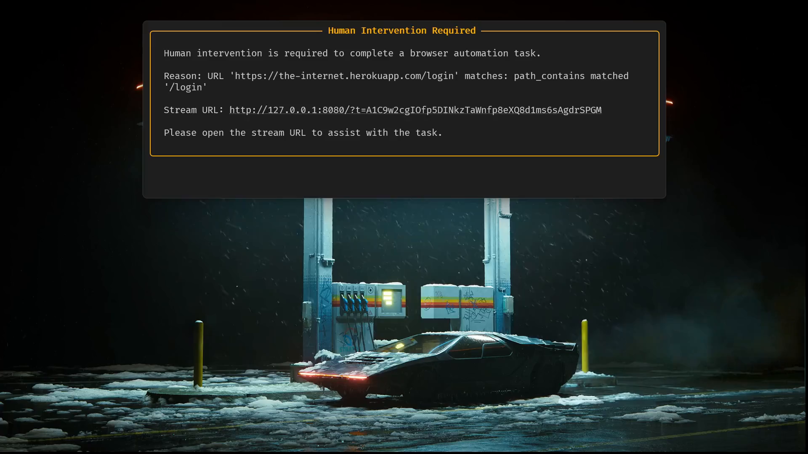

# browser-handoff

Pause your browser automation, hand the page to a human, resume when they're done.

When automation hits something only a human should do — login, 2FA, OAuth consent, payment, identity check — `browser-handoff` streams the live browser to an operator over the web, waits for them to finish, then gives control back to your script.

## Install

```bash
pip install browser-handoff
```

LLM-based detection (optional): `pip install browser-handoff[llm]`

## 30-second example

Opens [the-internet.herokuapp.com/login](https://the-internet.herokuapp.com/login) — a public testing site that displays its own credentials on the page (`tomsmith` / `SuperSecretPassword!`). The handoff fires as soon as the page loads, prints a stream URL for you to open, and resumes once you sign in successfully.

[](https://github.com/user-attachments/assets/493b2710-6b32-4593-b152-5f655b0c945e)

```python
import asyncio

from playwright.async_api import async_playwright

from browser_handoff import Handoff, Scenario
from browser_handoff.detection import Detection


async def main() -> None:
    handoff = Handoff()  # reusable: holds server + notifier config, nothing page-specific

    async with async_playwright() as pw:
        browser = await pw.chromium.launch(headless=True)
        page = await browser.new_page()
        await page.goto("https://the-internet.herokuapp.com/login")

        # Watch the page; hand off to a human when a trigger fires.
        result = await handoff.run(
            page,
            scenarios=[
                Scenario(
                    name="Heroku App Login",
                    trigger=Detection.url(path_contains=["/login"]),
                    complete=Detection.url(path_contains=["/secure"]),
                ),
            ],
            timeout=10,
        )
        if result.was_blocked and not result.timed_out:
            print(f"Human completed: {result.scenario_name} in {result.duration:.1f}s")

        # Back in script mode — confirm we landed on the post-login page.
        print(f"Now at: {page.url}")
        await browser.close()


asyncio.run(main())
```

## How it works

A `Handoff` holds your transport config — the streaming server and notifiers — and is reusable across pages and runs. You decide *what* to watch for per call, so the same `Handoff` serves any number of scenarios.

**Let the library detect the moment** with `handoff.run(page, scenarios=[...])`. A `Scenario` is a pair: a `trigger` that says "stop, a human is needed" and a `complete` that says "OK, they're done." `run` watches every scenario's trigger. If none fires within `trigger_timeout` seconds, it returns `HandoffResult(was_blocked=False)` and your script keeps going. If one fires, it starts a local streaming server, surfaces the URL (printed to logs and pushed to your notifiers), and waits until that scenario's `complete` matches — or until one of the handoff timers fires (`access_timeout` if the operator never opens the link, `completion_timeout` if they open it but don't finish). On timeout the result has `timed_out=True` and `timeout_cause` set to `"access"` or `"completion"`. It never raises on timeout; check the result.

**Already know a human is needed?** Skip trigger detection and stream right away with `handoff.wait_for_completion(page, on=...)`. This is the right call when something upstream already decided — e.g. an AI agent navigated to the payment page itself — so watching for a trigger would be redundant:

```python
await handoff.wait_for_completion(
    page,
    on=Detection.url(path_contains=["/payment_done"]),
    reason="Payment page reached",
)
```

## Passthrough mode (cloud substrates)

When the page lives in a cloud browser substrate (Kernel, Browserbase, Steel, Cua, …) and `browser-handoff` runs on your machine, every CDP frame would have to travel from the substrate's datacenter to your machine and then back out to the operator — a double WAN hop that's observably unusable in practice.

Most substrates already ship their own first-class viewer. Passthrough mode delegates streaming to that viewer while `browser-handoff` keeps the detection, notification, and lifecycle responsibilities it's uniquely positioned to handle.

Same Heroku login flow as the 30-second example above, this time running on a [Kernel](https://onkernel.com) cloud browser:

```python
import asyncio

from kernel import AsyncKernel
from playwright.async_api import async_playwright

from browser_handoff import Handoff, Scenario
from browser_handoff.detection import Detection


async def main() -> None:
    handoff = Handoff()
    kernel = AsyncKernel()
    kernel_browser = await kernel.browsers.create()

    async with async_playwright() as pw:
        browser = await pw.chromium.connect_over_cdp(kernel_browser.cdp_ws_url)
        # Kernel browsers boot with one context + one page already attached.
        page = (browser.contexts[0] or await browser.new_context()).pages[0]
        await page.goto("https://the-internet.herokuapp.com/login")

        result = await handoff.run(
            page,
            scenarios=[
                Scenario(
                    name="Heroku App Login",
                    trigger=Detection.url(path_contains=["/login"]),
                    complete=Detection.url(path_contains=["/secure"]),
                ),
            ],
            timeout=10,
            stream_url=kernel_browser.browser_live_view_url,  # ← passthrough
        )
        if result.was_blocked and not result.timed_out:
            print(f"Human completed: {result.scenario_name} in {result.duration:.1f}s")
        print(f"Now at: {page.url}")

    await kernel.browsers.delete_by_id(kernel_browser.session_id)


asyncio.run(main())
```

What changes when `stream_url` is set:

- No local CDP screencast pump — the substrate's viewer owns frames.
- The operator opens a `browser-handoff` served wrapper URL that iframes the substrate's viewer, cropped to just the page content.
- Window maximization at handoff start gives the crop math a clean, deterministic rect.
- LLMDetection installs the same stealth in-page observer it uses in streaming mode (non-enumerable window stamp + capture/passive listeners on deliberate input — `mousedown` / `keydown` / `wheel` / `scroll` / `touchstart` / `input` / `paste`), with no detectable JS surface beyond a single non-enumerable random-named integer. Only installed after the operator opens the wrapper URL, so anyone with just the substrate viewer URL can't drive vision calls.

`stream_url` works on both entry points — `handoff.wait_for_completion(stream_url=...)` and `handoff.run(stream_url=...)`. Everything else (detection contracts, notifiers, completion semantics) is identical to streaming mode.

## Scope: what this is *not*

`browser-handoff` is for flows gated by **credentials or session state** — login pages, 2FA prompts, OAuth consent screens, payment forms, identity verification, T&C acceptance.

It is **not** an anti-bot bypass. Sites that fingerprint Playwright/CDP sessions as automation will keep refusing the flow even after a human solves a CAPTCHA, Cloudflare Turnstile, or similar challenge — the session itself is flagged, not the response. If that's your problem, you need an anti-detection browser, not a handoff tool.

## Detection

`Detection` is the factory for conditions:

```python
Detection.url(host_equals=["accounts.google.com"], path_contains=["/oauth"])
Detection.element(present=["input[type=password]"], visible=[".consent-modal"], missing=[".user-menu"])
Detection.content(title_contains=["Sign In"], body_matches=[r"verify.*you"])
Detection.llm(model="anthropic/claude-sonnet-4-5", condition="Login form is visible")
```

Combine them:

```python
Detection.any([d1, d2])    # OR
Detection.all([d1, d2])    # AND
Detection.not_(d1)         # NOT
```

## Notifications

If you pass no notifiers, the library falls back to a built-in `ConsoleNotifier` that prints a rich panel to stdout with the stream URL — so the link is always somewhere obvious. When you do pass notifiers, the library stays out of the way and only fires what you configured.

```python
from browser_handoff.notifiers import (
    ConsoleNotifier, DiscordNotifier, EmailNotifier, SlackNotifier,
)

Handoff(
    notifiers=[
        SlackNotifier(webhook_url="https://hooks.slack.com/..."),
        DiscordNotifier(webhook_url="https://discord.com/api/webhooks/..."),
        EmailNotifier(
            smtp_host="smtp.gmail.com", smtp_port=587,
            username="bot@x.com", password="...",
            to=["ops@x.com"],
        ),
        ConsoleNotifier(),  # explicit — add alongside others if you also want a local panel
    ],
)
```

## Server

Defaults to `127.0.0.1:8080` (loopback only) with a 10-minute human-completion budget. Set `host="0.0.0.0"` to expose on the LAN — e.g. for phone access or tunnel forwarding.

```python
from browser_handoff import ServerConfig

Handoff(
    server=ServerConfig(
        host="127.0.0.1",                             # "0.0.0.0" to expose on LAN
        port=8080,
        public_base="https://my-tunnel.example.com",  # what notifiers link to
        access_timeout=600,                           # pre-connect bound (s)
        completion_timeout=1800,                      # post-connect work budget (s)
        jpeg_quality=75,
        every_nth_frame=1,
    ),
)
```

### Access control

The stream URL carries a high-entropy capability token (`…/?t=<token>`): whoever holds the link can view **and control** the page, so treat it like a password. The token is unguessable, decoupled from internal ids, and expires when the handoff finishes or the worst-case session lifetime (`access_timeout` + `completion_timeout`) elapses — a stale link stops working. When exposing beyond loopback (`0.0.0.0`, a tunnel, or a sandbox preview URL), **serve over HTTPS/WSS** so the token isn't readable in transit; set `public_base` to your public `https://` origin and the operator link is built from it. There is no second factor yet — one leaked, still-active link grants control, so deliver it over a trusted channel.

## Examples

- [`Claude OAuth login handoff`](examples/claude_oauth_login_handoff/) — a working Claude OAuth flow that pairs `browser-handoff` with [`ccauth`](https://github.com/synacktraa/ccauth). `local.py` runs the flow on your machine; `in_daytona.py` runs the exact same `local.py` inside a Daytona sandbox so the human can log in from anywhere via the sandbox's preview URL.
- [`browser-use assisted shopping`](examples/browser_use_assisted_shopping/) — a [`browser-use`](https://github.com/browser-use/browser-use) agent buys a t-shirt on automationexercise.com. `browser-handoff` is exposed to the agent as a custom tool; the agent decides on its own when to call it (the login wall and the card form), and a human takes over for those steps while the agent drives the rest. `local.py` runs against a local Chromium; `using_kernel.py` runs the same flow against a [Kernel](https://onkernel.com) cloud browser in passthrough mode — the operator's wrapper iframes Kernel's WebRTC live view directly, no double-hop streaming.

## License

Apache 2.0 — see [LICENSE](LICENSE) and [NOTICE](NOTICE).
